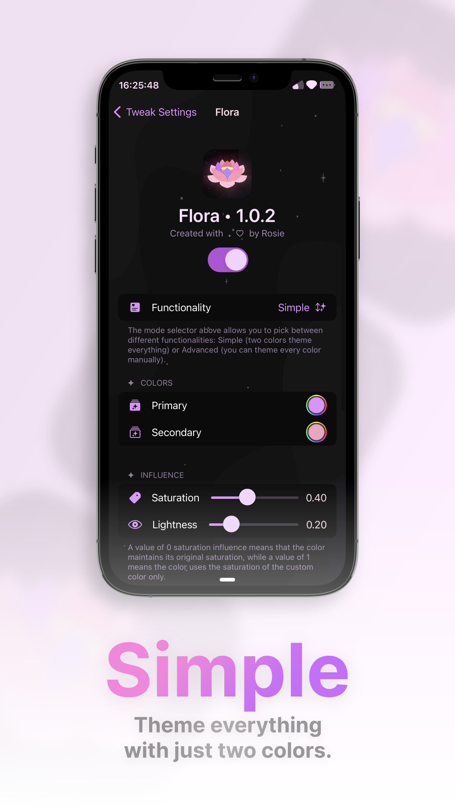

#  Flora - iOS 14-16

## A tweak to customize all of your iOS colors!

#### Flora was built to be the successor to older tweaks like [Kaleidoscope](https://sparkdev.me/) or [Spectrum](https://github.com/Skittyblock/Spectrum), but with a modern feel, built for the today, to run on iOS 14+.

  <table>
    <tr>
      <th>Advanced</th>
      <th>Simple</th>
      <th>Calculator</th>
      <th>Photos</th>
      <th>Files</th>
    </tr>
    <tr>
      <td width="20%">
        

            
        

      </td>
      <td width="20%">
        

            
        

      </td>
      <td width="20%" >
        

            
        

      </td>
      <td width="20%">
        

            
        

      </td>
      <td width="20%">
        

            
        

      </td>
    </tr>
  </table>

### ✩ *If you like this project, consider giving it a star!* ✩

### ♡ **Features**

- Allows you to change all of the **colors** on iOS:
  - **Simple** Mode:
    - **2 colors** theme all of the iOS colors
    - The colors have a 40% saturation influence
    - The colors have a 20% lightness influence
    - The alpha of the colors has no influence
  - **Advanced** Mode:
    - You can manually choose every iOS color.
    - The alpha of the color does influence the real color

- Allows you to **Export/Import** your colors!
  - Simply go to Flora's preferences and tap on the **Export** and **Import** buttons!

- Colors are themed inside **Apps**!
  - Enable Flora and watch as your colors magically change in all of your applications too, thanks to [libSandy](https://github.com/opa334/libSandy)

> If you have any questions, please [raise an issue](https://github.com/acquitelol/flora/issues/new) :3

### ♡ **How to build**

- Install **[Theos](https://theos.dev/docs/installation)** if you haven't already.
- Install **[LibGcUniversal](https://github.com/MrGcGamer/LibGcUniversalDocumentation?tab=readme-ov-file#installation-in-theos)** (also install the library on your device from [Havoc](sileo://source/https://havoc.app/))
- Install **[libSandy](https://github.com/opa334/libSandy?tab=readme-ov-file#functions-provided-by-libsandy)** (also install the library on your device from [BigBoss](sileo://source/http://apt.thebigboss.org/repofiles/cydia/))
- Install **GNU Make** (usually installed via `brew install make` on MacOS)
- Run `sh ./make.sh` while in this directory and wait for it to build
- You should find the `Flora.deb` build artifact in `./packages`
- **You're done!**

### ♡ **Licensing**

- Copyright © 2023 Rosie ([acquitelol](https://github.com/acquitelol))
- For licensing, please view the [LICENSE](https://github.com/acquitelol/flora/blob/main/LICENSE) file.

<a href="#top">⇡ Back to top️!</a>
